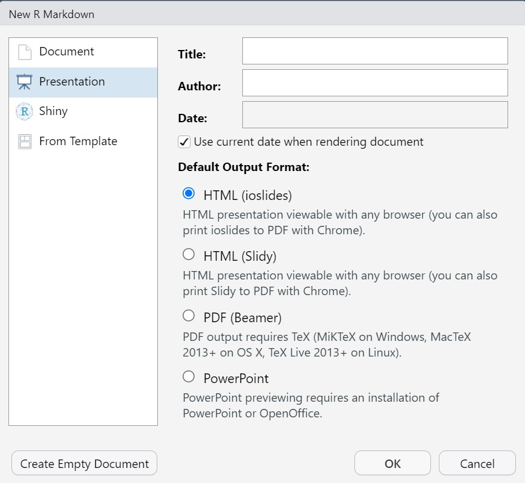
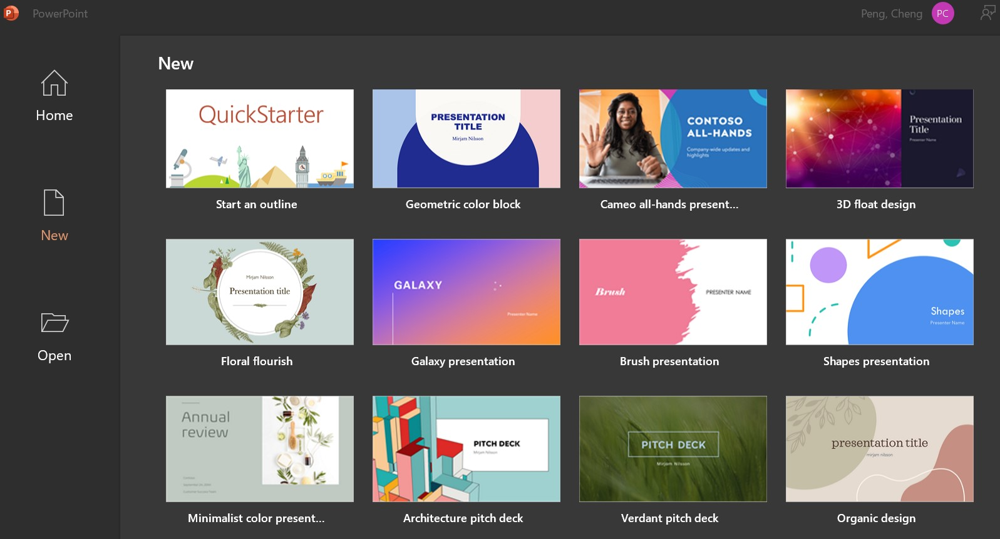

```{r setup, include=FALSE}
if (!require("knitr")) {
   install.packages("knitr")
   library(knitr)
}

if (!require("plotly")) {
   install.packages("plotly")
   library(plotly)
}
if (!require("ggplot2")) {
   install.packages("ggplot2")
   library(ggplot2)
}
if (!require("shiny")) {
   install.packages("shiny")
   library(shiny)
}
# install.packages("devtools")
# devtools::install_github('emitanaka/anicon')
knitr::opts_chunk$set(echo = FALSE)
```


## <font color = "white">R Markdown Presentation Formats</font> 
<!-- Topic transition slide. Single # has the same effect -->

### Table of Contents

<div style="float: left; width: 50%;">
+ Presentation formats in RMD
  - Interactive presentation
  - Non-interactive presentation
+ Tools for preparing presentation slides
  - HTML tags
  - Markdown syntax
  - optional CSS 
+ Presentation themes
  - Built-in themes for beamer slides
  - user defined themes with CSS
+ Special syntax for creating slides
  
</div>

<div style="float: right; width: 50%;">
+ Visual object inclusion 
  - Static and interactive graphs
  - external images and animated graphs
  - embedding webpages
  - including interactive apps from other platforms
  - including opened non-html-based documents 
+ Making compatible tables
  - Markdown tables
  - Kables and tibbles
</div>


## <!-- -->

<center><font color= "gold" size = 6 style="font-variant: small-caps;">This Slidedeck Is Made With</font>
<font color= "white" size = 6> 
```{r}
anicon::nia("ioslides", animate = "pulse")
```
</font></center> 


<BR><BR>

<p><font  style="color:white; size:5"> 
<ul>
<li> 1. There are only three types of slides in **ioslides**:
  <ul>
     <li> title slide (layout defined in YAML)
     <li> transitional slide (could use a selected color for the background)
     <li> regular slide (usually with a white background, but could choose a different color through CSS)
  </ul>
<br>
<li> Start a transition slide with <font style="font-family: 'Courier New', monospace;">##</font>
<li> Start a regular slide with <font style="font-family: 'Courier New', monospace;"> ### </font>
<li> Multi-column slide layout with < <font style="font-family: 'Courier New', monospace;">div</font> ></ <font style="font-family: 'Courier New', monospace;">div></font>
</ul> 
</font></p>


## <font color = "white">R Markdown Presentation Formats  </font>


### Four Formats  
<!-- regular Slide title-->

<div style="float: left; width: 40%;">

+ Interactive Presentations

  - **ioslides** (HTML), 

  - **slidy** (HTML), 

+ Static Presentations

  - **beamer**(PDF, MikTex is needed), and 

+ Semi-interactive Presentation

  - **Power Point** (Our old friend!). 
</div>

<div style="float: left; width: 60%;">

```{r}

```
</div>


## <font color = "white">Interactive Web Presentations  </font>

### Overlay Density Curves

```{r echo=FALSE}
# define three densities
sepal.len.setosa <- iris[which(iris$Species == "setosa"),]
setosa <- density(sepal.len.setosa$Sepal.Length)
sepal.len.versicolor <- iris[which(iris$Species == "versicolor"),]
versicolor <- density(sepal.len.versicolor$Sepal.Length)
sepal.len.virginica <- iris[which(iris$Species == "virginica"),]
virginica <- density(sepal.len.virginica$Sepal.Length)
# plot density curves
fig <- plot_ly(x = ~virginica$x, y = ~virginica$y, 
               type = 'scatter', mode = 'lines', 
               name = 'virginica', 
               fill = 'tozeroy')  %>% 
           # adding more density curves
       add_trace(x = ~versicolor$x, y = ~versicolor$y, 
                 name = 'versicolor', fill = 'tozeroy')  %>% 
       add_trace(x = ~setosa$x, y = ~setosa$y, 
                 name = 'setosa', fill = 'tozeroy')  %>%   
       layout(xaxis = list(title = 'Sepal Length'),
              yaxis = list(title = 'Density'))
fig
```


### Embedded Webpage

<div class='wrap'>
<iframe src="https://chpeng.shinyapps.io/LSE-Reg/" height="600" width="900" title="Iframe Example"></iframe>
</div>


### Embedded Interactive Apps

<center><div class='wrap'>
<iframe src="https://wcu-peng.shinyapps.io/NormalCI4MeanProp/" height="500" width="700" title="Iframe Example"></iframe>
</div></center>


### Interactive Dashboard

<div class='tableauPlaceholder' id='viz1703541329040' style='position: relative'><noscript><a href='#'>

</a></noscript>
<object class='tableauViz'  style='display:none;'>
<param name='host_url' value='https%3A%2F%2Fpublic.tableau.com%2F' /> 
<param name='embed_code_version' value='3' /> 
<param name='site_root' value='' />
<param name='name' value='SupplychainDashboard&#47;1KPIDashboard' />
<param name='tabs' value='yes' /><param name='toolbar' value='yes' />
<param name='static_image' value='https:&#47;&#47;public.tableau.com&#47;static&#47;images&#47;Su&#47;SupplychainDashboard&#47;1KPIDashboard&#47;1.png' /> 
<param name='animate_transition' value='yes' />
<param name='display_static_image' value='yes' />
<param name='display_spinner' value='yes' />
<param name='display_overlay' value='yes' />
<param name='display_count' value='yes' />
<param name='language' value='en-US' />
</object></div>                

<script type='text/javascript'>                    
var divElement = document.getElementById('viz1703541329040');                    
var vizElement = divElement.getElementsByTagName('object')[0];                    vizElement.style.width='1100px';vizElement.style.height='900px';                   
var scriptElement = document.createElement('script');                    
scriptElement.src = 'https://public.tableau.com/javascripts/api/viz_v1.js';                    vizElement.parentNode.insertBefore(scriptElement, vizElement);                
</script>


### Searchable Data Table


```{r eval=requireNamespace("DT", quietly=TRUE)}
DT::datatable(head(mtcars), fillContainer = FALSE, options = list(pageLength = 4))
```


## <font color = "white">Beamer and Beamer Themes </font>

### Beamer Built-in Themes

<center><div class='wrap'>
<iframe src="https://pengdsci.github.io/Beamer/" height="300px" width="80%" style="border:1px solid black;"></iframe>
</div></center>


### A Sample Beamer Presentation

<center><div class='wrap'>
<object data="https://pengdsci.github.io/sta553/w03-Ethics.pdf" type="application/pdf" width="80%" height="430px">
      <p>Unable to display PDF file. <a href="https://pengdsci.github.io/sta553/w03-Ethics.pdf">Download</a> instead.</p>
    </object>
</div></center>


## <font color = "white">Our Old Friend - PPT! </font>


### PowerPoint from MS Suite

```{r width="60%"}

```

### PowerPoint from RMarkdown

<center><div class='wrap'>
<object data="https://pengdsci.github.io/Beamer/misc/RMD2PPT.pdf" type="application/pdf" width="100%" height="450px">
      <p>Unable to display PDF file. <a href="https://pengdsci.github.io/Beamer/misc/RMD2PPT.pdf">Download</a> instead.</p>
    </object>
</div></center>


### RMD Source for PPT

<center><div class='wrap'>
<object data="https://pengdsci.github.io/Beamer/misc/RMD2PPT-Source.pdf" type="application/pdf" width="100%" height="450px">
      <p>Unable to display PDF file. <a href="https://pengdsci.github.io/Beamer/misc/RMD2PPT-Source.pdf">Download</a> instead.</p>
    </object>
</div></center>


## <font color = "white">A Flexible and Beautiful Presentation: Ninja </font>

### What Is Presentation Ninja?

<center><div class='wrap'>
<iframe src="https://annakrystalli.me/talks/xaringan/xaringan.html#1" height="300px" width="90%" style="border:1px solid black;"></iframe>
</div></center>


