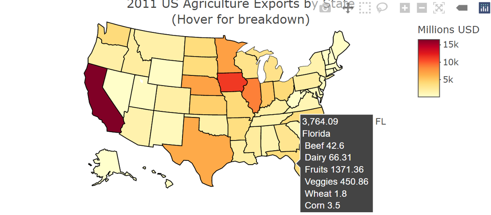

<style type="text/css">

div#TOC li {
    list-style:none;
    background-image:none;
    background-repeat:none;
    background-position:0;
}
h1.title {
  font-size: 24px;
  color: DarkRed;
  text-align: center;
}
h4.author { /* Header 4 - and the author and data headers use this too  */
    font-size: 18px;
  font-family: "Times New Roman", Times, serif;
  color: DarkRed;
  text-align: center;
}
h4.date { /* Header 4 - and the author and data headers use this too  */
  font-size: 18px;
  font-family: "Times New Roman", Times, serif;
  color: DarkBlue;
  text-align: center;
}
h1 { /* Header 3 - and the author and data headers use this too  */
    font-size: 22px;
    font-family: "Times New Roman", Times, serif;
    color: darkred;
    text-align: center;
}
h2 { /* Header 3 - and the author and data headers use this too  */
    font-size: 18px;
    font-family: "Times New Roman", Times, serif;
    color: navy;
    text-align: left;
}

h3 { /* Header 3 - and the author and data headers use this too  */
    font-size: 15px;
    font-family: "Times New Roman", Times, serif;
    color: darkred;
    font-face: bold;
    text-align: left;
}

h4 { /* Header 4 - and the author and data headers use this too  */
    font-size: 18px;
    font-family: "Times New Roman", Times, serif;
    color: darkred;
    text-align: left;
}
/* Tab features */
.nav>li>a {
    position: relative;
    display: block;
    padding: 10px 15px;
    color: #990000;
}
.nav-pills>li.active>a, .nav-pills>li.active>a:hover, .nav-pills>li.active>a:focus {
    color: #ffffff;
    background-color: #990000;
}
/* center maps using chunk option: fig.align='center' */
.html-widget {
    margin: auto;
}
</style>

```{r setup, include=FALSE}
# code chunk specifies whether the R code, warnings, and output 
# will be included in the output files.
if (!require("tidyverse")) {
   install.packages("tidyverse")
   library(tidyverse)
}
if (!require("knitr")) {
   install.packages("knitr")
   library(knitr)
}
if (!require("plotly")) {
   install.packages("plotly")
   library(plotly)
}
if (!require("gapminder")) {
   install.packages("gapminder")
   library(gapminder)
}
if (!require("RCurl")) {
    install.packages("RCurl")             # Install RCurl package
    library("RCurl")
}
if (!require("colourpicker")) {
    install.packages("colourpicker")              
    library("colourpicker")
}
if (!require("gganimate")) {
    install.packages("gganimate")              
    library("gganimate")
}
if (!require("gifski")) {
    install.packages("gifski")              
    library("gifski")
}
if (!require("magick")) {
    install.packages("magick")              
    library("magick")
}
if (!require("grDevices")) {
    install.packages("grDevices")              
    library("grDevices")
}
if (!require("leaflet")) {
    install.packages("leaflet")              
    library("leaflet")
}
if (!require("maps")) {
    install.packages("maps")              
    library("maps")
}
if (!require("htmltools")) {
    install.packages("htmltools")              
    library("htmltools")
}
if (!require("htmlwidgets")) {
    install.packages("htmlwidgets")              
    library("htmlwidgets")
}
if (!require("leaflegend")) {
    install.packages("leaflegend")              
    library("leaflegend")
}
if (!require("geojsonio")) {
    install.packages("geojsonio")              
    library("geojsonio")
}
if (!require("stringi")) {
    install.packages("stringi")              
    library("stringi")
}
if (!require("RColorBrewer")) {
    install.packages("RColorBrewer")              
    library("RColorBrewer")
}
if (!require("tigris")) {
    install.packages("tigris")              
    library("tigris")
}
if (!require("leafpop")) {
    install.packages("leafpop")              
    library("leafpop")
}
if (!require("leafem")) {
    install.packages("leafem")              
    library("leafem")
}
if (!require("tmap")) {
    install.packages("tmap")              
    library("tmap")
}
if (!require("tmaptools")) {
    install.packages("tmaptools")              
    library("tmaptools")
}
if (!require("webshot2")) {
    install.packages("webshot2")              
    library("webshot2")
}
if (!require("sf")) {
    install.packages("sf")              
    library("sf")
}
if (!require("terra")) {
    install.packages("terra")              
    library("terra")
}
if (!require("leafpop")) {
    install.packages("leafpop")              
    library("leafpop")
}

##
knitr::opts_chunk$set(echo = TRUE,       
                      warning = FALSE,   
                      result = TRUE,   
                      message = FALSE,
                      comment = NA)
```


# {.tabset .tabset-fade .tabset-pills}

<BR><BR>
There is a very rich set of tools for interactive geospatial visualization. This note introduces various R tools and Tableau to create interactive maps for visualizing spatial patterns.  <br>

<font color = "darkred"><b>Caution</b></font>: Recent changes to popular R packages for spatial data - what you need to do (<https://www.r-bloggers.com/2023/06/upcoming-changes-to-popular-r-packages-for-spatial-data-what-you-need-to-do/>).

<BR>
<BR>

## Map Types

<BR>
There are two common ways of representing spatial data on a map:

* Defining regions on a map and distinguishing them based on their value on some measure using colors and shading. This type of map is usually called `choropleth map`. 

* Marking individual points on a map based on their longitude and latitude (e.g., archaeological dig sites; baseball stadiums; voting locations, etc.). This type of map is also called a `scatter map`. 

Plotting `scatter maps` uses geocode and are relatively easier to create. However, a choropleth map is constructed using data with a special structure with shape information. It is relatively harder to construct a choropleth map.

**A basemap** provides context for additional layers that are overlaid on top of the basemap. Basemaps usually provide location references for features that do not change often like boundaries, rivers, lakes, roads, and highways. Even on basemaps, these different categories of information are in layers. Usually a basemap contains this basic data, and then extra layers with particular information from a particular data set, are overlaid on the base map layers for visual analysis.

In this note, the basemaps come primarily from the open-data-source-based [OpenStreepMap](https://www.openstreetmap.org/#map=5/38.007/-95.844).

<BR><BR>
<center><font color = "red"  size =4><b> Choropleth Map </b></font></center>
<BR>
<br>
<center></center>
<BR><BR>
<center><font color = "red"  size =4><b> Scatter Map </b></font></center>
<BR>
<br>
<center></center>
<br>


## Leaflet Maps

<BR><BR>
We will use R `leaflet` library to create both reference maps and choropleth maps and plot data on maps to display spatial patterns.
<BR><BR>

<font size = 4, color = "red"><b> Reference Maps </b></font>
<BR><BR>

### 1. Introduction

`Leaflet` is one of the most popular open-source JavaScript libraries for interactive maps. It’s used widely in practice. It has many nice features. R package `leaflet` allows us to make interactive maps using map tiles, markers, polygons, lines, and popups, etc.

The function `leaflet()` returns a Leaflet map widget, which stores a list of objects that can be modified or updated later. Most functions in this package have an argument map as their first argument, which makes it easy to use the pipe operator `%>%`. 

Creating a leaflet map with R library `leaflet` consisting of the following steps.

* Create a map widget by calling leaflet().

* Add layers (i.e., features) to the map by using layer functions (e.g. addTiles, addMarkers, addPolygons) to modify the map widget.

* Repeat the previous as desired.

* Print the map widget to display it.

Let’s look at the following simple example.

```{r fig.align='center', fig.height=4, fig.width=6}
# library(leaflet)        # it has been loaded in the setup chunk.
# define a leaflet map 
m <- leaflet() %>%
     setView(lng=-75.5978, lat=39.9522, zoom = 20) %>%
     addTiles() %>%        # Add default OpenStreetMap map tiles
     addMarkers(lng=-75.5978, lat=39.9522)
m    # Print the map
```

### 2. Customizing Marker Icons

We can manipulate the attributes of the map widget using a series of methods. 

* `setView()` sets the center of the map view and the zoom level;
* `fitBounds()` fits the view into the rectangle [lng1, lat1] – [lng2, lat2];
* `clearBounds()` clears the bound, so that the view will be automatically determined by the range of latitude/longitude data in the map layers if provided;

We can also define our own markers and added to the map object. For example, we use WCU's logo as a custom marker and add it to the previous map.

```{r fig.align='center', fig.height=4, fig.width=6}
# define a marker using WCU's logo.
wcuicon <- makeIcon(
  iconUrl = "https://github.com/pengdsci/sta553/blob/main/image/goldenRamLogo.png?raw=true",
  iconWidth = 60, iconHeight = 60
  )
# define a leaflet map 
m <- leaflet() %>%
     setView(lng=-75.5978, lat=39.9522, zoom = 20) %>%
     addTiles() %>%        # Add default OpenStreetMap map tiles
     addMarkers(lng=-75.5978, lat=39.9522,  icon = wcuicon)
m    # Print the map
```

### 3. Popups and Labels

Popups are small boxes containing arbitrary HTML, that point to a specific point on the map. We can use the `addPopups()` function to add a standalone popup to the map. When you click the marker in the following map, you will see a popup with the name of the WCU campus.

```{r fig.align='center', fig.height=4, fig.width=6}
df <- read.csv(textConnection(
"Name, Lat, Long
WCU Philadelphia Campus,39.9518,-75.1525
WCU South Campus,39.9373,-75.6011
WCU Main Campus, 39.9524,-75.5982"
))

leaflet(df) %>% 
  addTiles() %>%
  setView(lng=-75.3768, lat=39.9448, zoom = 10) %>%
  addMarkers(~Long, ~Lat, popup = ~paste("Name: ",Name))
```

We can also change the popups in the above map to labels. The modified code is shown below

```{r fig.align='center', fig.height=4, fig.width=6}
df <- read.csv(textConnection(
"Name, Lat, Long
WCU  Philadelphia Campus,39.9518,-75.1525
WCU  South Campus,39.9373,-75.6011
WCU  Main Campus, 39.9524,-75.5982"
))

leaflet(df) %>% 
  addTiles() %>%
  setView(lng=-75.3768, lat=39.9448, zoom = 10) %>%
  addMarkers(~Long, ~Lat, label = ~paste("Name:", Name))
```


### 4. Annotations

We have introduced the ways of adding hover messages through `label` and `pop` options to points on the map longitude and latitude. We also used reference location using longitude and latitude to insert images to a map. 

This section introduced a method to insert text and image annotation to a map. The idea is to wrap the annotation in an HTML tag and then pass the information to map through `addControl()` function. This method will also be used when we create shiny apps.  The relative location on the map is independent on longitude and latitude. We can use location values such as `topleft, topright, bottomleft, bottomright`.


```{r fig.align='center', fig.height=4, fig.width=6}
df <- read.csv(textConnection(
"Name, Lat, Long
WCU  Philadelphia Campus,39.9518,-75.1525
WCU  South Campus,39.9373,-75.6011
WCU  Main Campus, 39.9524,-75.5982"
))
## HTML wrapped annotation
 AnnotateWrapper <- tags$div(
   HTML('<center><a href="https://www.wcupa.edu/">  </a><center>
    <font color = "purple">WCU STA 553 Example</font>')
 )  
###
leaflet(df) %>% 
  addTiles() %>%
  #addProviderTiles("NASAGIBS.ViirsEarthAtNight2012") %>%
  setView(lng=-75.3768, lat=39.9448, zoom = 10) %>%
  addMarkers(~Long, ~Lat, popup = ~paste("Name:", Name, 
                                         "<br> Longitude:", Long, 
                                         "<br>Latitude:", Lat), 
             label = ~paste("Name:", Name))%>%
  addControl(AnnotateWrapper, position = "bottomleft")
```


### 5. An Example Using Real-World Data 

In the following example, we use a few leaflet functions to add some features such as drawing highlight boxes, labels, etc. to the map.

```{r fig.align='center', fig.height=4, fig.width=6}
# Define bounding box using the range of longitude/latitude coordinates
# from the given data set
housing.price <- read.csv("Realestate.csv")
# making static leaflet map
leaflet(housing.price) %>%
  addTiles() %>% 
  setView(lng=mean(housing.price$Longitude), lat=mean(housing.price$Latitude), zoom = 14) %>%
   addRectangles(
    lng1 = min(housing.price$Longitude), lat1 = min(housing.price$Latitude),
    lng2 = max(housing.price$Longitude), lat2 = max(housing.price$Latitude),
    #fillOpacity = 0.2,
    fillColor = "transparent" 
    ) %>%
  fitBounds(
    lng1 = min(housing.price$Longitude), lat1 = min(housing.price$Latitude),
    lng2 = max(housing.price$Longitude), lat2 = max(housing.price$Latitude) ) %>%
  addMarkers(~Longitude, ~Latitude, label = ~PriceUnitArea)
```

In the next map based on the data, we add more information to that map to display higher dimensional information.

```{r fig.align='center', fig.height=4, fig.width=6}
housing.price <- na.omit(read.csv("Realestate.csv"))
## color coding a continuous variable: 
colAge <- cut(housing.price$HouseAge, breaks=c(0, 5, 15, max(housing.price$HouseAge)+1), right = FALSE)
colAgeNum <- as.numeric(colAge)
##
ageColor <- rep("navy", length(colAge))
ageColor[which(colAgeNum==2)] <- "orange"
ageColor[which(colAgeNum==3)] <- "darkred"
## define label with hover messages

label.msg <- paste("Unit Price:", housing.price$PriceUnitArea,    
                   "<br>Dist to MRT:",housing.price$Distance2MRT)

#labels = cat(label.msg)
# making leaflet map
leaflet(housing.price) %>%
  addTiles() %>% 
  setView(lng=mean(housing.price$Longitude), lat=mean(housing.price$Latitude), zoom = 13) %>%
  #OpenStreetMap, Stamen, Esri and OpenWeatherMap.
  #addProviderTiles("Esri.WorldGrayCanvas") %>%
  addProviderTiles(providers$Esri.WorldGrayCanvas) %>%
  addCircleMarkers(
            ~Longitude, 
            ~Latitude,
            color = ageColor,
            radius = ~ sqrt(housing.price$Distance2MRT/10)*0.7,
            stroke = FALSE, 
            fillOpacity = 0.4,
            popup= ~label.msg)  %>%
  addLegend(position = "bottomright", 
            colors = c("navy", "orange","darkred"),
            labels= c("[0,5)", "[5,15)", "[15,44.8)"),
            title= "House Age",
            opacity = 0.4) %>%
  addLegendSize(position = 'topright', 
                  values = sqrt(housing.price$Distance2MRT/10)*0.5,
                   color = 'gray',
               fillColor = 'gray',
                 opacity = .5,
                   title = 'Distance to MRT',
                   shape = 'circle',
             orientation = 'horizontal',
                  breaks = 5)
```


<BR><BR>

<font size = 4, color = "red"><b> Chorapleth Maps </b></font>
<BR><BR>

### Choropleth Maps With Leaflet

As an example, we use shape file [shape file of US states (https://pengdsci.github.io/STA553VIZ/w07/us-states.geojson) ](https://pengdsci.github.io/STA553VIZ/w07/us-states.geojson) to represent aggregated information at the state level.


```{r}
# Map data preparation
electricitycost <-as.tibble(read.csv("https://github.com/pengdsci/sta553/raw/main/data/state_electricity_data_2018.csv")[-9,])  # exclude DC
electricitycost <- electricitycost %>% 
  rename(name = NAME)
#electricitycost$State <- state.abb  # add state abbrevs to specify locations in plot_ly()
# Make state borders red
borders <- list(color = toRGB("red"))
## State shapefile
USStateShpeURL <-"https://raw.githubusercontent.com/PublicaMundi/MappingAPI/master/data/geojson/us-states.json"
#USStateShpeURL <- "https://pengdsci.github.io/STA553VIZ/w07/us-states.geojson"
stateShape <- geojson_read(USStateShpeURL, what = "sp")
## The sp object created above (“states”) stores its data in slots, 
## which can be accessed with the “@” operator.
stateShape@data = left_join(stateShape@data, electricitycost)
# CAUTION: must use left_join to keep all states that were included in the state GEOJSON file!!!
# Create hover text
popuptext = paste('<strong>',stateShape@data$name, "</strong>",'<br>', "Electricity Cost:", stateShape@data$centskWh)
##
pal <- colorNumeric(
    palette = "Oranges",
    domain = stateShape@data$centskWh
)
###
simpleVersion = leaflet(data = stateShape) %>%
    addProviderTiles(provider = "CartoDB.Positron")  %>% 
    setView(lat = 38.0110306, lng = -110.4080342, zoom = 3) %>%
    addPolygons(fillColor = ~pal(centskWh), 
        fillOpacity = 0.8, 
        color = "darkred", 
        weight = 1,
        popup = ~popuptext) %>%
    addLegend(position = "bottomleft",
              pal = pal, 
              values = ~stateShape@data$centskWh, 
              title = "<strong>Price</strong><br>(2008)") 
simpleVersion
```

\

\

We could also add a title with predefined styles, annotated text, and images through HTML tags. Here is an example.

```{r}
## map title
title <- tags$div( HTML('<font color = "darkred" size =4><b>Average Electricity Price by State (cent/KW/hr)</b></font>')
)
## adding a gif image to the map
 GIFimg <- tags$div(
   HTML('<center> <center>'))
###
EnhancedMap <- simpleVersion %>%
     addControl(title, position = "topright") %>%
     addControl(GIFimg, position = "bottomright")
EnhancedMap
```


## Plotly Map

`plotly` aims to be a general-purpose visualization library, and thus, doesn’t aim to be the most fully-featured geospatial visualization toolkit. 

`plotly` uses several different ways to create maps – each with its strengths and weaknesses. It utilizes plotly.js's built-in support to render the basemap layer. The types of basemap used in plotly are [Mapbox](https://www.mapbox.com/) (third party software that requires an access token) and D3.js powered basemap. In other words, plotly does not use [OpenStreetMap](https://www.openstreetmap.org/#map=4/38.01/-95.84) that is used in `leaflet`, `Mapviewer`, `ggplot2`,`Shiny`, and Tableau.

We will not use `Mapbox` in this note and focus on the D3.js basemap that does not have many details. The plot function `plot_geo()` will be used to make quick maps.


<BR><BR>
<center><font size = 4, color = "red"><b> Choropleth Maps </b></font></center> 
<BR><BR>

In the following, we will introduce the steps for creating Choropleth maps. Since Choropleth maps need to fill and color small regions such as district, county, states, etc., it requires the data set to have a special structure that contains shape information. Two plot constructor functions `plot_ly()` and `plot_geo()` will be introduced to create choropleth maps.

* **`plot_ly()`** requires specifying `type = choropleth` to make a map (basemap from plotly.js). Information in the data set is integrated to the maps by various arguments of `plot_ly()` and relevant graphic functions that are compatible with `plot_ly()`.

* **`plot_geo()`** requires `addTrace()` to make choropleth maps and integrate data information to the maps with relevant arguments in `addTrace()` and graphic functions compatible with `plot_geo()`.  


<BR>
### 1. Choropleth Maps with `plot_ly()`
<BR>

In general, making choropleth maps with `plot_ly()` requires two main types of input:

* Geometry information provided by 
  + one of the built-in geometries within plot_ly such as US states and world countries. See the following example 1: visualizing 2018 electricity cost per state. 
  + a supplied GeoJSON file where each feature has either an id field or some identifying value in properties. See the following example 2: visualizing the unemployment rate of US counties

* A list of values indexed by feature identifier. They control the features in the map including boundary, filled colors, legend, hover text, etc.


For the US map, two types of projections were commonly use: regulary and Albers.

<br>
<center></center>
<br>


**Example 1:** US electricity cost by States in 2018. The arguments `locations =` and `locationmode =` tell `plot_ly` what map information should be used to create the base map. Other arguments and functions are used to control different features of the resulting map. One cautionary note is that `plot_ly()` only uses state abbreviations as the state name.

In the code, the state abbreviations `state.abb` is a built-in data set. Several other built-in data sets about each state are also available. Check the website <http://stats4stem.weebly.com/r-statex77-data.html> for more information on these data sets.


```{r}
# Map data preparation
electricitycost <-read.csv("https://github.com/pengdsci/sta553/raw/main/data/state_electricity_data_2018.csv")[-9,]  # exclude DC
electricitycost$State <- state.abb  # add state abbrevs to specify locations in plot_ly()
# Create hover text
electricitycost$hover <- with(electricitycost, paste(State, '<br>', "Electricity Cost:", centskWh))
# Make state borders white
borders <- list(color = toRGB("red"))
# Set up some mapping options
map_options <- list(
  scope = 'usa',
  projection = list(type = 'albers usa'),
  showlakes = TRUE,
  lakecolor = toRGB('white')
)
plot_ly( z = ~electricitycost$centskWh, 
        text = ~electricitycost$hover, 
        locations = ~electricitycost$State, 
        type = 'choropleth', 
        locationmode = 'USA-states', 
        colors = 'RdPu', 
        color = electricitycost$centskWh, 
        marker = list(line = borders)) %>%
  layout(title = 'US State Electricity Unit Cost (cents/kWh)', 
         geo = map_options)

```

**Example 2:** The unemployment rates of US counties. This example requires a JSON file to provide necessary geometric information (shape polygon) about each county in the US. The argument `locations = ` accepts FIPS (Federal Information Process System) for US county maps. The geometric information of the US county shape is supplied in a JSON file and used through the argument `geojson = `.   


```{r}
#library(plotly)
#library(rjson)
#library("RColorBrewer")  # brewer.pal.info for list of color scales

url <- 'https://github.com/pengdsci/sta553/raw/main/data/geojson-counties-fips.json'  # contains geocode to define county boundaries in the choropleth map
counties <- rjson::fromJSON(file=url)  
load("img07//unemp.rda")
#load("/Users/chengpeng/WCU/Teaching/2022Spring/STA553/RMaps/unemp.rda")
df=unemp
g <- list(
      scope = 'usa',
      projection = list(type = 'albers usa'),
      showlakes = TRUE,
      lakecolor = toRGB('white')
    )
###
fig <- plot_ly()  %>% 
  add_trace( type = "choropleth",
          geojson = counties,
        locations = df$fips,
                z = df$rate,
       colorscale = "GnBu",  
             zmin = 0,
             zmax = 30,
             text = df$name, # hover mesg
           marker = list(line=list(width=0.2))
          )   %>% 
  colorbar(title = "Unemployment Rate (%)",
           colorscale='Viridis')  %>% 
  layout( ### Title 
          title =list(text = "US Unemployment by County", 
                          font = list(family = "Times New Roman",  # HTML font family  
                                        size = 18,
                                       color = "red")), 
          geo = g)
## The actual HTML page does shoe colorbar correctly, we hide the legend.
hide_legend(fig)

```

**Example 3** US states facts. Similar to example 1, but with more variables. The data set is built-in in the base R package.

```{r}
# Create data frame
state_pop <- read.csv("https://raw.githubusercontent.com/pengdsci/sta553/main/data/USStatesFacts.csv")
# Create hover text
state_pop$hover <- with(state_pop, 
                        paste(STName, '<br>', "Population:", Population,
                              '<br>', "Income:", Income,
                              '<br>', "Life.Exp:", Life.Exp,
                              '<br>', "Murder:", Murder,
                              '<br>', "HS.Grad:", HS.Grad))
# Make state borders white
borders <- list(color = toRGB("red"))
# Set up some mapping options
map_options <- list(
  scope = 'usa',
  projection = list(type = 'regular usa'),
  showlakes = TRUE,
  lakecolor = toRGB('white')
)
plot_ly(z = ~state_pop$Population, 
        text = ~state_pop$hover, 
        locations = ~state_pop$State, 
        type = 'choropleth', 
        locationmode = 'USA-states', 
        color = state_pop$Population, 
        colors = 'YlOrRd', 
        marker = list(line = borders)) %>%
  layout(title = 'US Population in 1975', geo = map_options)
```


<BR>
### 2. Choropleth Maps with `plot_geo()`
<BR>
Making a choropleth map with `plot_geo` requires less effort to prepare the shape data. The geo-information was called through `locations = ` and `locationmode = `.

<BR>
```{r}
# library(plotly)
# read in cv data
df <- read.csv("https://raw.githubusercontent.com/pengdsci/sta553/main/data/2011_us_ag_exports.csv")
## Define hover text
df$hover <- with(df, paste(state, "\n",
                           "Beef", beef, "\n",
                           "Dairy", dairy, "\n",
                           "Fruits", total.fruits, "\n",
                           "Veggies", total.veggies, "\n",
                           "Wheat", wheat, "\n",
                           "Corn", corn))

# give state boundaries a white border
l <- list(color = toRGB("white"), width = 2)
# specify some map projection/options
g <- list(     scope = 'usa',
          projection = list(type = 'albers usa'),
           showlakes = TRUE,
           lakecolor = toRGB('white')
      )
## plot map
m <- plot_geo(df, locationmode = 'USA-states') %>%
     add_trace(        z = ~total.exports, 
                    text = ~hover, 
               locations = ~code,
                   color = ~total.exports, 
                  colors = 'YlOrRd'
              )  %>% 
     colorbar(title = "Millions USD")  %>% 
     layout( title = '2011 US Agriculture Exports by State<br>(Hover for breakdown)',
               geo = g
            )
m
```


Since the colorbars are not displayed correctly in the kitted HTML document, we take a screenshot in the following to display the correct colorbar.

```{r fig.align='center', out.width="80%"}

```


<BR><BR>
<center><font size = 4, color = "red"><b> Scatter Maps </b></font></center>
<BR><BR>

### 3.Scatter Map with `plot_geo()` and `add_markers()`

A Scatter map is relatively easier to make since we only plot the base map using the longitude and latitude. No map shape information is needed for scatter maps.


**Example 4** US Airport Traffic.

```{r}
#library(plotly)
df <- read.csv('https://raw.githubusercontent.com/pengdsci/sta553/main/data/2011_february_us_airport_traffic.csv')
# geo styling
g <- list(      scope = 'usa',
           projection = list(type = 'albers usa'),
             showland = TRUE,
            landcolor = toRGB("gray95"),
         subunitcolor = toRGB("gray85"),
         countrycolor = toRGB("gray85"),
         countrywidth = 0.5,
         subunitwidth = 0.5
       )
###
fig <- plot_geo(df, lat = ~lat, lon = ~long) %>% 
  add_markers( text = ~paste(airport, city, state, 
                             paste("Arrivals:", cnt), 
                             sep = "<br>"),
              color = ~cnt, 
              symbol = "circle", 
              size = ~cnt, 
              hoverinfo = "text")   %>% 
  colorbar(title = "Incoming flights<br>2011.2")  %>% 
  layout( title = 'Most trafficked US airports', 
          geo = g )

fig
```

<BR><BR>
<center><font size = 4, color = "red"><b> Custom Maps </b></font></center>
<BR><BR>

### 4. Custom Map With Special Libraries
<br>
Sometimes, we may want to use custom maps to represent spatial information. For example, if we want to visualize the area of US states, the previous US maps are fine. If we want to represent the population size (Example 3), we may want to use a map such that the displayed area is proportional to the population size but not the geographical area. These types of custom maps need special tools to construct. Show you an exam without providing code to make the map.

**Example 4** US population by states.

<BR>
<br>
<center></center>
<BR><BR>


## Thematic Maps

The `tmap` package is a relatively new way to plot thematic maps in R. Thematic maps are geographical maps in which spatial data distributions are visualized. This package offers a flexible and layer-based approach to creating thematic maps, such as choropleths and bubble maps. The syntax for creating plots is similar to that of ggplot2.

`tmap_mode()` will be used to determine interactivity of the map: `tmap_mode("plot")` produce static maps and `tmap_mode("view")` produce interactive maps.

### 1. Choropleth Maps

We will use a built-in world shapefile, `World`, that contains information about population, gdp, life expectancy, income, happiness index, etc.

Both choropleths and scatter maps will be illustrated using the built-in data.

**Example 1: Choropleths**: The default world map with the distribution of mean life expectancy among all countries. The default `tmap_mode` is set to be `plot`. The default `tmap` map is static.

```{r}
library(tmap)
data(World)
tm_shape(World) +
    tm_polygons("life_exp")
```

**Example 2: Interactive Map**: use the above static map as the base map and add interactive features to the maps. The mode can be set with the function `tmap_mode()`, and toggling between the modes can be done with the ‘switch’ `ttm()` (which stands for toggle thematic map.

```{r}
library(tmap)
#
tmap_mode("view")  # "view" gives interactive map; "plot" gives static map. 
##
## tmap_style set to "classic"
tmap_style("classic")
## other available styles are: "white", "gray", "natural", 
## "cobalt", "col_blind", "albatross", "beaver", "bw", "watercolor"
tmap_options(bg.color = "skyblue", 
             legend.text.color = "white")
##
tm_shape(World) +
      tm_polygons("life_exp", 
                  legend.title = "Life Expectancy") +
      tm_layout(bg.color = "gray", 
                inner.margins = c(0, .02, .02, .02)) 
```

### Mixed Maps (Multilayer)

Through a multilayer map, we can make a choropleth and place another on top of it. In the following example, we add one additional layer using the `metro` shapefile and plot the center of the metro area to get a scatter map.

**Example 3: Mixed Map: two-layer mixes maps**

```{r}
library(tmap)
#*
data(metro)
##
tmap_mode("view")  # "view" gives interactive map; 
#tmap_style("classic") ## tmap_style set to "classic"
## other available styles are: "white", "gray", "natural", 
## "cobalt", "col_blind", "albatross", "beaver", "bw", "watercolor"
tmap_options(bg.color = "skyblue", 
             legend.text.color = "white")
##
tm_shape(World) +
      tm_polygons("life_exp", 
                  legend.title = "Life Expectancy") +
      tm_layout(bg.color = "gray", 
                inner.margins = c(0, .02, .02, .02)) + 
tm_shape(metro) +
      tm_symbols(col = "purple", 
                 size = "pop2020", 
                 scale = .5,
                 alpha = 0.5,
                 popup.vars=c("pop1950", "pop1960", "pop1980","pop1990",                   "pop2000","pop2010","pop2020")) 
```


```{r}
library(spData)
library(sf)
library(mapview)
gj = "https://github.com/azavea/geo-data/raw/master/Neighborhoods_Philadelphia/Neighborhoods_Philadelphia.geojson"
##
gjsf = st_read(gj)
library(tmap)
#    tm_shape(World) +
    tm_shape(gjsf)  + 
      tm_polygons(legend.show = FALSE)  +
      tm_bubbles("shape_area",            
                 #col = "shape_area", 
                 #breaks=seq(1276674, 129254597, length = 6),
                 palette="-RdYlBu", 
                 contrast=1)
```


### Scatter Maps With geoCoordinates

We use the real estate data set to make a scatter map using library `tmap`. We first need to define an `sf` object using `st_as_sf()` that shapefile with an individual point based on the longitude and latitude in the data set.


```{r}
library(tmap)
library(sf)
realestate0 <- read.csv("Realestate.csv", header = TRUE)
realest <- realestate0[, -1]
## create a shapefile with POINT type.
realest <-st_as_sf(realest, coords=c("Longitude","Latitude"), crs = 4326)
###
tm_shape(realest) + 
  tm_dots(col = "purple", 
          size = "Distance2MRT", 
          alpha = 0.5,
          popup.vars=c("HouseAge", "PriceUnitArea", "NumConvenStores"),
          shapes = c(1, 0)) 
```


## Tableau Maps

We create a choropleth map and a scatter map respectively in this note. Before creating maps, we first look understand the structure of Tableau's sheet.

<center>

</center>

We can see that each Tableau book has several components:

* **A - Workbook name** - A workbook contains sheets. A sheet can be a worksheet, a dashboard, or a story. 

* **B - Cards and shelves** - Drag fields to the cards and shelves in the work-space to add data to your view.

* **C - Toolbar** - Use the toolbar to access commands and analysis and navigation tools.

* **D - View** - This is the canvas in the work-space where you create a visualization (also referred to as a "viz").

* **E - Start page icon** - Click this icon to go to the Start page, where you can connect to data. For more information, see Start Page.

* **F - Side Bar** - In a worksheet, the side bar area contains two tabs: the Data pane and the Analytics pane.

* **G - Data Source** - Click this tab to go to the Data Source page and view your data. 

* **H - Status bar** - Displays information about the current view.

* **I - Sheet tabs** - Tabs represent each sheet in your workbook. This can include worksheets, dashboards, and stories. You can rename and add more of these sheets, dashboards and stories if needed.

* **Show Me** - Click this toggle to select 24 built-in charts and the information needed to create these charts. 


### Choropleth Map

The data set we use for a choropleth map can be downloaded from <https://raw.githubusercontent.com/pengdsci/sta553/main/data/USStatesFacts.csv>.

You need to download save this data file in a folder and then connect it to Tableau Public (or Tableau Online).

The following are steps for making a choropleth map:

1. Load the .csv file to Tableau (Public); 

2. Click `sheet1` in the bottom left taskbar;

3. Drag variable `State` (on the left navigation panel under the table) to the main drop field (Tableau considers `State` as a geo-variable); at the same time, the two generated `Longitude(generated)` and `Latitude(generated)` appear in the column and row fields automatically.

4. Click the `Show Me` (on the right side of a tiny color bar chart) in the top right of the screen;

5. You will see a list of graphs. Click the middle `world map` in the second row, you will see an initial choropleth map. 

6. Click `Show Me` again to close the popup. We can click the legend on the top-right color to change the color of the map (if you like).

7. To add more information to the hover text, you drag the variables on the list to the small icon labeled with `Detail`.

8. Click `Sheet 1` to change it to a meaningful title. 

9. Finally we label the states by their abbreviations. To do this, drag `State` to `Label` in the `Marks` table (next to `Detail`).  

10. You can edit the hover text by clicking `Tooltip`.  


The resulting map can be viewed on the Tableau Public Server at
<https://public.tableau.com/app/profile/cpeng/viz/US-States-Facts/Sheet1>


<table border = 0 bordercolor="darkgreen" bgcolor='#f6f6f6'  width=100%  align = center> 
<tr>
<td>
<div class='tableauPlaceholder' id='viz1709002997666' style='position: relative'>
<noscript><a href='#'></a>
</noscript>
<object class='tableauViz'  style='display:none;'>
<param name='host_url' value='https%3A%2F%2Fpublic.tableau.com%2F' /> 
<param name='embed_code_version' value='3' /> 
<param name='path' value='shared&#47;4DNFJ3HGR' /> 
<param name='toolbar' value='yes' />
<param name='static_image' value='https:&#47;&#47;public.tableau.com&#47;static&#47;images&#47;4D&#47;4DNFJ3HGR&#47;1.png' /> <param name='animate_transition' value='yes' />
<param name='display_static_image' value='yes' />
<param name='display_spinner' value='yes' />
<param name='display_overlay' value='yes' />
<param name='display_count' value='yes' />
<param name='language' value='en-US' />
</object>
</div>               

<script type='text/javascript'>                    
var divElement = document.getElementById('viz1709002997666');                    
var vizElement = divElement.getElementsByTagName('object')[0];                    vizElement.style.width='100%';vizElement.style.height=(divElement.offsetWidth*0.75)+'px';                    
var scriptElement = document.createElement('script');                    
scriptElement.src = 'https://public.tableau.com/javascripts/api/viz_v1.js';                    vizElement.parentNode.insertBefore(scriptElement, vizElement);                
</script>
</td>
</tr>
</table>


### Scatter Map

We use housing price data with longitude and latitude associated with each property. The data set is at <https://projectdat.s3.amazonaws.com/Realestate.csv>

As we did in the previous example, we download the data set and save it in a folder.

The following are steps to create a scatter map.

1. Open the Tableau and connect the data source to Tableau.

2. After the data has been loaded to the Tableau, click `Sheet1`, you will see the list of variables on the left panel.

3. click `Latitude` -> `Geographic Role` -> `Latitude`; do the same thing to `Longitude`. 

4. Drag `Latitude` to the `Columns` field and `Longitude` to the `Rows` field. You will see a single point in `Sheet 1`. The two variables were automatically renamed as `AVG(Latitude)` and `AVG(Longitude)`.

5. Click `AVG(Latitude)` and select `dimension`, you will see a line plot in `Sheet 1`. Do the same thing to `AVG(Longitude)`. Now you see a scatter plot.

6. Click `Show Me` (top-right corner of `Book 1`) and select the left-hand side map icon (the first one in the second row), you will see an initial scatter map.

7. We want to use the size of the point to reflect the unit price. we drag `PriceUnitArea` to `Size` card in the `Marks` shelf.

8. Click `Show Me` to close the chart menu. Click `SUM(Price Unit Area)` (top-right corner) to change the point size.

9. I drag `Transaction Year` to the `Color` card to reflect the transaction year. We should choose a divergent color scale.

10. drag variables to the `Detail` card to be shown in the hover text.

11. Since many unit prices are close to each other, there are overlapped points. So we want to change the level of opacity. To do this, click `Color` card, choose the appropriate level of opacity, and edit the color to make a better map.

12. Add a meaningful title.

13. Right click the map and select `Map Layers` make the changes on the map background and layers.

14. Other edits and modifications to improve map.


The resulting map can be viewed on the Tableau Public Server at
<https://public.tableau.com/app/profile/cpeng/viz/RealEstateData_16469067466610/Sheet1>


<table border = 0 bordercolor="darkgreen" bgcolor='#f6f6f6'  width=100%  align = center> 
<tr>
<td>

<div class='tableauPlaceholder' id='viz1709004421419' style='position: relative'>
<noscript><a href='#'></a>
</noscript>
<object class='tableauViz'  style='display:none;'>
<param name='host_url' value='https%3A%2F%2Fpublic.tableau.com%2F' /> 
<param name='embed_code_version' value='3' /> 
<param name='site_root' value='' />
<param name='name' value='RealEstateData_16469067466610&#47;Sheet1' />
<param name='tabs' value='no' />
<param name='toolbar' value='yes' />
<param name='static_image' value='https:&#47;&#47;public.tableau.com&#47;static&#47;images&#47;Re&#47;RealEstateData_16469067466610&#47;Sheet1&#47;1.png' /> 
<param name='animate_transition' value='yes' />
<param name='display_static_image' value='yes' />
<param name='display_spinner' value='yes' />
<param name='display_overlay' value='yes' />
<param name='display_count' value='yes' />
<param name='language' value='en-US' />
</object>
</div>                
<script type='text/javascript'>                    
var divElement = document.getElementById('viz1709004421419');                    
var vizElement = divElement.getElementsByTagName('object')[0];                    vizElement.style.width='100%';vizElement.style.height=(divElement.offsetWidth*0.75)+'px';                    
var scriptElement = document.createElement('script');                    
scriptElement.src = 'https://public.tableau.com/javascripts/api/viz_v1.js';                    vizElement.parentNode.insertBefore(scriptElement, vizElement);                
</script>
</td>
</tr>
</table>

## R Color Palettes
<BR>
Since color coding is particularly important in map representation. We can use the following code to view various defined color scales (continuous and discrete) in the R library `RColorBrewer`.
<BR>
* **Sequential palettes** are suited to ordered data that progress from low to high (gradient). The palettes names are : `Blues`, `BuGn`, `BuPu`, `GnBu`, `Greens`, `Greys`, `Oranges`, `OrRd`, `PuBu`, `PuBuGn`, `PuRd`, `Purples`, `RdPu`, `Reds`, `YlGn`, `YlGnBu`, `YlOrBr`, `YlOrRd`.

* **Qualitative palettes** are best suited to represent nominal or categorical data. They do not imply magnitude differences between groups. The palettes names are : `Accent`, `Dark2`, `Paired`, `Pastel1`, `Pastel2`, `Set1`, `Set2`, `Set3`.

* **Diverging palettes** put equal emphasis on mid-range critical values and extremes at both ends of the data range. The diverging palettes are : `BrBG`, `PiYG`, `PRGn`, `PuOr`, `RdBu`, `RdGy`, `RdYlBu`, `RdYlGn`, `Spectral`.

<BR><BR>

### All Palettes

```{r fig.align='center', fig.height=7, fig.width=4}
library("RColorBrewer")
display.brewer.all() 
```


### **2. Color-bind Friendly Palettes**

```{r fig.align='center', fig.height=6, fig.width=4}
library("RColorBrewer")
display.brewer.all(colorblindFriendly = TRUE) 
```


### **3. Color Palette Codes**

```{r}
library("RColorBrewer")
kable(brewer.pal.info)
```

### **4. Functions for Selecting Specific Color Palettes**

Two functions can be used to display a specific color palette or return the code of the palette.

* `display.brewer.pal(n, name)` displays a single `RColorBrewer` palette by specifying its name.

* `brewer.pal(n, name)` returns the hexadecimal color code of the palette.

The two arguments:

`n` = Number of different colors in the palette, minimum 3, maximum depending on palette.

`name`= A palette name from the lists above. For example name = RdBu.


**Example 1**: Display the first 8 colors of palette `Dark2`.

```{r, fig.align='center', fig.width=6, fig.height=3}
# View a single RColorBrewer palette by specifying its name
display.brewer.pal(n = 8, name = 'Dark2')
```

**Example 2**: Return the hexadecimal of the first 8 colors of palette `Dark2`.

```{r}
# Hexadecimal color specification 
kable(t(brewer.pal(n = 8, name = "Dark2")))
```

**A. Functions Calling Specific `rcolorbrewer` Palette in `ggplot()`**

The following color scale functions are available in ggplot2 for using the `rcolorbrewer` palettes:

`scale_fill_brewer()` for box plot, bar plot, violin plot, dot plot, etc.

`scale_color_brewer()` for lines and points


**B. Functions Calling Specific `rcolorbrewer` Palette in Base Plots**

The function `brewer.pal()` is used to generate a vector of colors.

```{r, fig.align='center', fig.width=4, fig.height=5}
# Barplot using RColorBrewer
barplot(c(2,5,7), col = brewer.pal(n = 3, name = "Dark2"))
```


