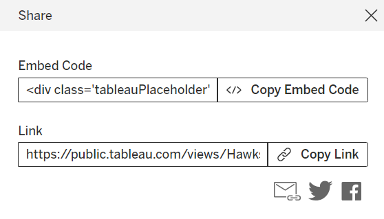

<style type="text/css">

div#TOC li {
    list-style:none;
    background-image:none;
    background-repeat:none;
    background-position:0;
}
h1.title {
  font-size: 24px;
  color: DarkRed;
  text-align: center;
}
h4.author { /* Header 4 - and the author and data headers use this too  */
    font-size: 18px;
  font-family: "Times New Roman", Times, serif;
  color: DarkRed;
  text-align: center;
}
h4.date { /* Header 4 - and the author and data headers use this too  */
  font-size: 18px;
  font-family: "Times New Roman", Times, serif;
  color: DarkBlue;
  text-align: center;
}
h1 { /* Header 3 - and the author and data headers use this too  */
    font-size: 22px;
    font-family: "Times New Roman", Times, serif;
    color: darkred;
    text-align: center;
}
h2 { /* Header 3 - and the author and data headers use this too  */
    font-size: 18px;
    font-family: "Times New Roman", Times, serif;
    color: navy;
    text-align: left;
}

h3 { /* Header 3 - and the author and data headers use this too  */
    font-size: 15px;
    font-family: "Times New Roman", Times, serif;
    color: navy;
    text-align: left;
}

h4 { /* Header 4 - and the author and data headers use this too  */
    font-size: 18px;
    font-family: "Times New Roman", Times, serif;
    color: darkred;
    text-align: left;
}
img {
  border: 1px solid #555;
}
</style>

```{r setup, include=FALSE}
# code chunk specifies whether the R code, warnings, and output 
# will be included in the output files.
if (!require("Stat2Data")) {
   install.packages("Stat2Data")
   library(Stat2Data)
}
if (!require("knitr")) {
   install.packages("knitr")
   library(knitr)
}

knitr::opts_chunk$set(echo = TRUE,       
                      warning = FALSE,   
                      result = TRUE,   
                      message = FALSE,
                      comment = NA)
```

\

\


# Introduction

Among all specialized visualization software programs, Tableau is probably the most widely used and popular in the industry because it does not require much coding effort. It also provides users enough flexibility to design advanced visualizations by defining new variables based on existing variables. 

Tableau visual objects are created with variables in the data table. Like other point-and-click statistical software programs such as MINITAB, it offers some basic functions one can use to define new fields in the data set to perform related visualization.  

Tableau is primarily designed as a visualization tool. It also has limited capacity for data integration. This and the next notes focus only on visualization. Therefore, we assume that we have a single clean data ready 


# Working Data and Data Loading

The Hawks data set was collected by students from Cornell College. It is built in the R library {Stat2Data}. I also made a copy and posted it at <https://raw.githubusercontent.com/pengdsci/sta553/main/Tableau/hawks.csv>. You can download it and save it to a folder on your machine.

```{r}
data("Hawks")
write.csv(Hawks[which(Hawks$Tail > 175),], file="C:/Users/75CPENG/OneDrive - West Chester University of PA/Desktop/cpeng/WCU-Teaching/2024Spring/STA553/w09/tableau/hawks.csv")
```


Tableau uses a menu-driven approach to load data in certain formats. The following figure shows the types of external data that are connected to Tableau. There are some built-in data sets available in Tableau for practice purposes.


We open the program and see the following UI.

<br>
<center>

</center>
<br>

The Hawks data is in CSV format, we choose `text file` to connect to the data set. After the data is connected, we will see the following Data Source page with brief information about the data set.

<br>
<center>

</center>
<br>

We can explore the variables in the data set on the data source page. We can connect to multiple data sets and merge them on this page.


## Opening Work Sheet

Click the Sheet tab in the bottom left of the data source data, we will the list of the variables and the panels of visualization tools for making charts.

<br>
<center>

</center>
<br>

Statistical charts are created on different sheets. We can add more sheets as needed and change the default sheet’s name to a meaningful name.

Next, we create commonly used statistical charts in separate sheets.


# Basic Statistical Charts with Existing Variables

## Bar Chart

Bar charts are one of the most common data visualizations. We can use them to quickly compare data across categories, highlight differences, show trends and outliers, and reveal historical highs and lows at a glance. Bar charts are especially effective when you have data that can be split into multiple categories.

We consider the distribution of hawk species. Change `Sheet 1` to `barChart`.

**Step 1**: Drag `Species` to the Column field

**Step 2**: Drag `Species` to the Row field and change it to counts (frequencies).

<center>
  <table border="0">
	<col style="width:47%">
	<col style="width:6%">
	<col style="width:47%">
   <tr>
    <td></td>
    <td>
    </td>
    <td></td>
   </tr>
  </table>
</center>


## Pie Chart

Pie charts are powerful for adding detail to other visualizations. Alone, a pie chart doesn’t give the viewer a way to quickly and accurately compare the information. Since the viewer has to create context on their own, key points from your data are missed. Instead of making a pie chart the focus of your dashboard, try using it to drill down on other visualizations.

**Step 1**: repeat the two steps in the bar chart.

**Step 2**: Click `Show Me` on the top-right of the UI and select `piechart icon`.

**Step 3**: Select the `Entire View` from the top panel drop-down menu.

**Step 4**: drag `Species` to `Label` in **Marks** panel.

<center>
  <table border="0">
	<col style="width:47%">
	<col style="width:6%">
	<col style="width:47%">
   <tr>
    <td></td>
    <td>
    </td>
    <td></td>
   </tr>
  </table>
</center>


## Histogram

A histogram is a chart that displays the shape of a distribution. A histogram looks like a bar chart but groups values for a continuous measure into ranges or bins.

**Step 1**: drag `weight` to the column field.

**Step 2**: click `show me`, in the drop-down menu and select `histogram` icon.

**Step 3**: Click `color` icon in the Marks panel to adjust the color and border of the histogram.


<center>
  <table border="0">
	<col style="width:47%">
	<col style="width:6%">
	<col style="width:47%">
   <tr>
    <td></td>
    <td>
    </td>
    <td></td>
   </tr>
  </table>
</center>


## Box-plot

We can use box plots, also known as box-and-whisker plots, to show the distribution of values along an axis. Boxes indicate the middle 50 percent of the data (that is, the middle two quartiles of the data's distribution).

The following steps are used to create a simple box plot.

**Step 1**: add a numerical variable to the sheet (we use `weight` in this example).

**Step 2**: change `weight` to dimension. It will automatically create a default box plot with data points plotted on the numerical axis.

**Step 3**: Change the appearance of the box-plot by selecting **Entire View** (see the  screenshot) 

**Step 4**: choose `Gantt Bar` to show the density of the values and edit the boxplot to get a better chart.

<center>
  <table border="0">
	<col style="width:47%">
	<col style="width:6%">
	<col style="width:47%">
   <tr>
    <td></td>
    <td>
    </td>
    <td></td>
   </tr>
  </table>
</center>


## Line Chart

The line chart, or line graph, connects several distinct data points, presenting them as one continuous evolution. Use line charts to view trends in data, usually over time (like stock price changes over five years or website page views for the month). The result is a simple, straightforward way to visualize changes in one value relative to another.

**Step 1**: Drap `year` to the column field and `Species` to the row field and convert them into frequencies.

**Step 2**: Click `Show Me` on the top-right of the UI and select the `line plot` icon.

**Step 3**: right-click `Species` and `Sex` and send them to the **Filter** panel.

**Step 4**: Choose an appropriate display form of the filter (see the right panel of the following screenshot)

<center>
  <table border="0">
	<col style="width:47%">
	<col style="width:6%">
	<col style="width:47%">
   <tr>
    <td></td>
    <td>
    </td>
    <td></td>
   </tr>
  </table>
</center>


## Scatter Plot

Scatter plots are an effective way to investigate the relationship between different variables, showing if one variable is a good predictor of another, or if they tend to change independently. A scatter plot presents lots of distinct data points on a single chart. The chart can then be enhanced with analytics like cluster analysis or trend lines.

Let's explore the association between the lengths of wings and tails of hawks across the species. The following steps create a simple scatter plot in Tableau. 

**Step 1**: drag the two numerical variables to column and row fields.

**Step 2**: Change the two aggregated variables (by default) to `dimension` (see the left-hand side screenshot).

**Step 3**: Color code the species (drag `species` to the **color** mark).

**Step 4**: Choose the categorical variables to define filters to explore the association of a subset of the data (partial association) using the drop-down menu, radio button, slider, etc.

<center>
  <table border="0">
	<col style="width:47%">
	<col style="width:6%">
	<col style="width:47%">
   <tr>
    <td></td>
    <td>
    </td>
    <td></td>
   </tr>
  </table>
</center>


## Bubble Chart

Although bubbles aren’t technically their own type of visualization, using them as a technique adds detail to scatter plots or maps to show the relationship between three or more measures. Varying the size and color of circles creates visually compelling charts that present large volumes of data at once.

A bubble chart is modified from a regular scatter plot. We next use the above scatter plot as a base plot and make the point size proportional to the value of the variable `wing`.

**Step 1**: create a basic scatter plot (following steps 1-4 in the previous section of the scatter plot).

**Step 2**: drag variable `wing` to **size** icon (Marks panel).

**Step 3**: right **color** icon in Marks panel to adjust transparency and modify the point border to make partially overlapped points distinguishable.

**Step 4**: convert `year` to a string variable and add `sex` and `year` to the filter.

**Step 5**: Change the default display of year from `select menu` to **drop-down menu** and `sex` to **radio button**


<center>
  <table border="0">
	<col style="width:47%">
	<col style="width:6%">
	<col style="width:47%">
   <tr>
    <td></td>
    <td>
    </td>
    <td></td>
   </tr>
  </table>
</center>


## Treemap

Treemaps relate different segments of your data to the whole. As the name of the chart suggests, each rectangle in a treemap is subdivided into smaller rectangles, or sub-branches, based on its proportion to the whole. They make efficient use of space to show the percent total for each category.


## Maps

Maps are a no-brainer for visualizing any kind of location information, whether it’s postal codes, state abbreviations, country names, or your own custom geocoding. If you have geographic information associated with your data, maps are a simple and compelling way to show how location correlates with trends in your data. Let's look at a small data set with geo-information. The data set can be found at <https://raw.githubusercontent.com/pengdsci/datasets/main/Realestate.csv>. We first download this data and save it to a local folder so we can connect the data to Tableau.

The following steps will create a map to view the spatial distribution of properties in the bay area.


**Step 1**. Drag `longitude` and `latitude` to row and column fields respectively.

**Step 2**. Click `Show me` and select the World Map in the list of the template plots.

**Step 3**. Go to the top menu bar, and click `Map` to select a background map.

**Step 4**. Click the `Color` shelf in the Marks field, and change the default color to an appropriate color.

**Step 5**. Choose an appropriate color.

**Step 6**. select an appropriate variable to determine the point size.

**Step 7**. drag the variable you want to display in the hover text.

The following screenshot was created based on the above steps.


<center> </center>

\

The actual map is available on the Tableau Public Server at <https://public.tableau.com/app/profile/cpeng/viz/Book1_16487389941160/Sheet4?publish=yes>


## Density Maps

Density maps reveal patterns or relative concentrations that might otherwise be hidden due to an overlapping mark on a map—helping you identify locations with greater or fewer numbers of data points. Density maps are most effective when working with a data set containing many data points in a small geographic area.

Let's use the POC (US gas station data) as an example of how to handle the data with two data points. The data can be found at: <https://github.com/pengdsci/datasets/raw/main/POC.csv>. We first download this data file save it into a local folder and then connect Tableau to this data.

The following suggested steps will create a density map for the US gas stations.

**Step 1**. Convert `xcoord` and `ycoord` to longitude and latitude (see the left screenshot below).

**Step 2**. Drag `xcoord` and `ycoord` to row and column fields respectively.

**Step 3**. In the drop-down menu of the Marks field, select `density`.

**Step 4**. Go to the top menu bar, and click `Map` to select a background map.

**Step 5**. Click the `Color` shelf in the Marks field, and change the default color to an appropriate color.


<center>
  <table border="0">
	<col style="width:47%">
	<col style="width:6%">
	<col style="width:47%">
   <tr>
    <td></td>
    <td>
    </td>
    <td></td>
   </tr>
  </table>
</center>


The actual interactive map is on the Tableau Public Server at <https://public.tableau.com/app/profile/cpeng/viz/POC-map/Sheet1?publish=yes>

\

# Calculated Derived Features and Parameters

We have introduced some of the basic statistical graphics that only require point-and-click, Next we introduce graphics that require derived variables using Tableau's capability of creating calculated fields and parameters. 

Although Tableau is *not* a software program for statistical modeling, some of the built-in Tableau functions can be used for some basic modeling tasks. The detailed list of available Tableau functions can be found at [https://help.tableau.com/current/pro/desktop/en-us/functions.htm](https://help.tableau.com/current/pro/desktop/en-us/functions.htm). This note only focuses on descriptive visual analysis using simple builtin graphical functions.

In practice, many statistical procedures are based on the assumption of normal distribution. As an example, we will create a histogram of a numerical variable to visualize its distribution and then add a normal density curve on the top of the histogram to compare the empirical distribution with the actual theoretic normal distribution.

Recall that the general form of the normal density function of random variable $X$ has the following form

$$
f(x) = \frac{1}{\sqrt{2\pi} \sigma}e^{-\frac{(x-\mu)^2}{2\sigma^2}}
$$
where $\mu$ is the mean of $X$ and $\sigma$ the density function of $X$. To make a normal density curve that has the same mean and standard deviation as that of $X$, we need to add two fields, `xbar` and `sdx`, to **the worksheet** and then define the variable `fx` to draw the density curve. To 

Next, we define a parameter to specify the bin width when drawing histograms (density curves) and three new variables to draw the density curve.


## Create Parameters

When creating a histogram, we need to define the bin width (bandwidth, interval width, class width, ...) so that each data point will fall into one and only one bin (interval, class). Many statistical software programs run an algorithm and provide a default (optimal width from theory). In Tableau, we can define a bin size (i.e., width) manually so that the resulting histogram or density curve can be adjusted by changing the bin width to choose an appropriate width to better display the distribution from the visual perspective. The Tableau `parameter` allows users to change its value. We will define bin width as a parameter. The following figure illustrates the steps for defining the parameter. 


```{r fig.align='center', out.width="80%", echo = FALSE}

```


## Create Calculated Variables

We next define the mean and standard deviation of variable `Tail` stored in two fields of the workbook. The following figure shows the steps for defining the mean. We can similarly define the standard deviation.

```{r fig.align='center', out.width="80%", echo = FALSE}

```

**Comments**

1. We used `TOTAL` function in the above definition of the mean of the variable `Tail` (i.e., all values of variable `Tail` in the data table).

2. Tableau also provides a function `FIXED` that allows the calculation of grouped sum, mean, etc. For example, we can count the observations in each `year` using the following functions. Note that `F1` is the observation ID of the data.

```{r fig.align='center', out.width="40%", echo = FALSE}

```

3. Create `bin value` so that the histograms of `Tail` and `normalCurve` will use the same bin width.

```{r fig.align='center', out.width="40%", echo = FALSE}

```


4. `ATTR()` is a special Tableau function that effectively **returns a record-level result as an aggregation**. If there are multiple values of the record-level field in the current context then `ATTR()` will return the number of values instead of a single value.


Next, we use the formula of the density to calculate normal density scores and save them in the field `normalCurve`. The Tableau formula is given by

```{r fig.align='center', out.width="70%", echo = FALSE}

```


Steps for creating a histogram with a density curve being placed on the top of it.

1. Create two histograms: `Tail` and `normalCurve`.

```{r fig.align='center', out.width="90%", echo = FALSE}

```

2. Change the histogram of `normalCurve` to a density curve by changing the mark type from `Bar` to `Line` in the Marks panel

```{r fig.align='center', out.width="90%", echo = FALSE}

```

3. Right-click the left-hand side and select `Dual Axis` to place the density curve on the histogram


```{r fig.align='center', out.width="90%", echo = FALSE}

```

4. Right-click the right-hand side axis of the resulting overlay graph and uncheck `Show Header` to get the following.

```{r fig.align='center', out.width="90%", echo = FALSE}

```

5. **Wrap-up** After finishing the above steps, go to `file` and select `Save to Tableau Public...` or `Save to Tableau Public As` and fill in the text box, click `Save` button to publish the graph on the Tableau Public server. 


```{r fig.align='center', out.width="90%", echo = FALSE}

```


6. To embed the Tableau graph in the RMD and then render it in an HTML format, click the bottom-right **share** button.

```{r fig.align='center', out.width="40%", echo = FALSE}

```

We copy the embed code and paste it to the cell of the single-cell HTML table in the RMD document and edit it with the correct indention.  


````{verbatim}
<table border = 0 bordercolor="darkgreen" bgcolor='#f6f6f6'  width=100%  align = center>
<tr>
<td>
embedding JS code from Tableau...
</td>
</tr>
</table>
````

The following is the embedded interactive Tableau from the Tableau Public server.

<table border = 0 bordercolor="darkgreen" bgcolor='#f6f6f6'  width=100%  align = center>
<tr>
<td>

<div class='tableauPlaceholder' id='viz1711297426029' style='position: relative'>

<noscript><a href='#'></a>
</noscript>

<object class='tableauViz'  style='display:none;'>
<param name='host_url' value='https%3A%2F%2Fpublic.tableau.com%2F' /> 
<param name='embed_code_version' value='3' /> 
<param name='site_root' value='' />
<param name='name' value='Hawks_17112947852290&#47;HistDensity' />
<param name='tabs' value='no' />
<param name='toolbar' value='yes' />
<param name='static_image' value='https:&#47;&#47;public.tableau.com&#47;static&#47;images&#47;Ha&#47;Hawks_17112947852290&#47;HistDensity&#47;1.png' /> 
<param name='animate_transition' value='yes' />
<param name='display_static_image' value='yes' />
<param name='display_spinner' value='yes' />
<param name='display_overlay' value='yes' />
<param name='display_count' value='yes' />
<param name='language' value='en-US' />
</object></div>                

<script type='text/javascript'>                    
var divElement = document.getElementById('viz1711297426029');                    
var vizElement = divElement.getElementsByTagName('object')[0];                    vizElement.style.width='100%';vizElement.style.height=(divElement.offsetWidth*0.75)+'px';    
var scriptElement = document.createElement('script'); scriptElement.src = 'https://public.tableau.com/javascripts/api/viz_v1.js';                    vizElement.parentNode.insertBefore(scriptElement, vizElement);                
</script>

</td>
</tr>
</table>


## Practice - Reproduce The Following

<table border = 0 bordercolor="darkgreen" bgcolor='#f6f6f6'  width=100%  align = center>
<tr>
<td>
<div class='tableauPlaceholder' id='viz1711258738612' style='position: relative'>
<noscript><a href='#'></a>
</noscript>

<object class='tableauViz'  style='display:none;'>
<param name='host_url' value='https%3A%2F%2Fpublic.tableau.com%2F' /> 
<param name='embed_code_version' value='3' /> 
<param name='site_root' value='' />
<param name='name' value='w09HoneyProdDashImage&#47;HistogramPrice' />
<param name='tabs' value='no' /><param name='toolbar' value='yes' />
<param name='static_image' value='https:&#47;&#47;public.tableau.com&#47;static&#47;images&#47;w0&#47;w09HoneyProdDashImage&#47;HistogramPrice&#47;1.png' /> 
<param name='animate_transition' value='yes' />
<param name='display_static_image' value='yes' />
<param name='display_spinner' value='yes' />
<param name='display_overlay' value='yes' />
<param name='display_count' value='yes' />
<param name='language' value='en-US' />
</object>
</div>                

<script type='text/javascript'>                    
var divElement = document.getElementById('viz1711258738612');                   
var vizElement = divElement.getElementsByTagName('object')[0];                    vizElement.style.width='100%';vizElement.style.height=(divElement.offsetWidth*0.75)+'px';                   
var scriptElement = document.createElement('script');   scriptElement.src = 'https://public.tableau.com/javascripts/api/viz_v1.js'; 
vizElement.parentNode.insertBefore(scriptElement, vizElement);                
</script>
</td>
</tr>
</table>

# Animations, Annotations, Images and Tooltip Visuals

As we did in visualization with R, we can also animate Tableau graphics, insert annotations, images tooltip popups, etc. in Tableau graphics. Some of these graphical tasks are only one click away, and some of them require multi-step procedures. 

We can create static images as new shapes, additional worksheets to place in the tooltip, etc. to make more interactive Tableau graphics.  

The following Tableau graph contains several features. We can download the workbook through the bottom-right `download` icon.


<table border = 0 bordercolor="darkgreen" bgcolor='#f6f6f6'  width=100%  align = center>
<tr>
<td>
<div class='tableauPlaceholder' id='viz1711178458694' style='position: relative'>
  <noscript><a href='#'></a></noscript>
  <object class='tableauViz'  style='display:none;'>
  <param name='host_url' value='https%3A%2F%2Fpublic.tableau.com%2F' /> 
  <param name='embed_code_version' value='3' /> 
  <param name='site_root' value='' />
  <param name='name' value='w09HoneyProdDashImage&#47;DashImage' />
  param name='tabs' value='no' /><param name='toolbar' value='yes' />
  <param name='static_image' value='https:&#47;&#47;public.tableau.com&#47;static&#47;images&#47;w0&#47;w09HoneyProdDashImage&#47;DashImage&#47;1.png' /> 
  <param name='animate_transition' value='yes' />
  <param name='display_static_image' value='yes' />
  <param name='display_spinner' value='yes' />
  <param name='display_overlay' value='yes' />
  <param name='display_count' value='yes' />
  <param name='language' value='en-US' />
  </object></div>                
  
  <script type='text/javascript'>                    
  var divElement = document.getElementById('viz1711178458694');                    
  var vizElement = divElement.getElementsByTagName('object')[0];                    vizElement.style.minWidth='420px';vizElement.style.maxWidth='1250px';vizElement.style.width='100%';vizElement.style.minHeight='587px';vizElement.style.maxHeight='1187px';vizElement.style.height=(divElement.offsetWidth*0.75)+'px';                    
  var scriptElement = document.createElement('script');                    
  scriptElement.src = 'https://public.tableau.com/javascripts/api/viz_v1.js';                    vizElement.parentNode.insertBefore(scriptElement, vizElement);                
  </script>
</td>
</tr>
</table>

One way to Animate a Tableau graph is to select a variable and place it in the field of `Page`. One of the above worksheets contains an animated graph. 


\

\


